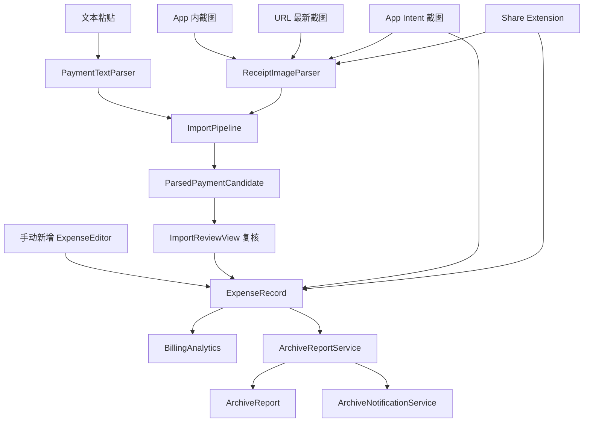
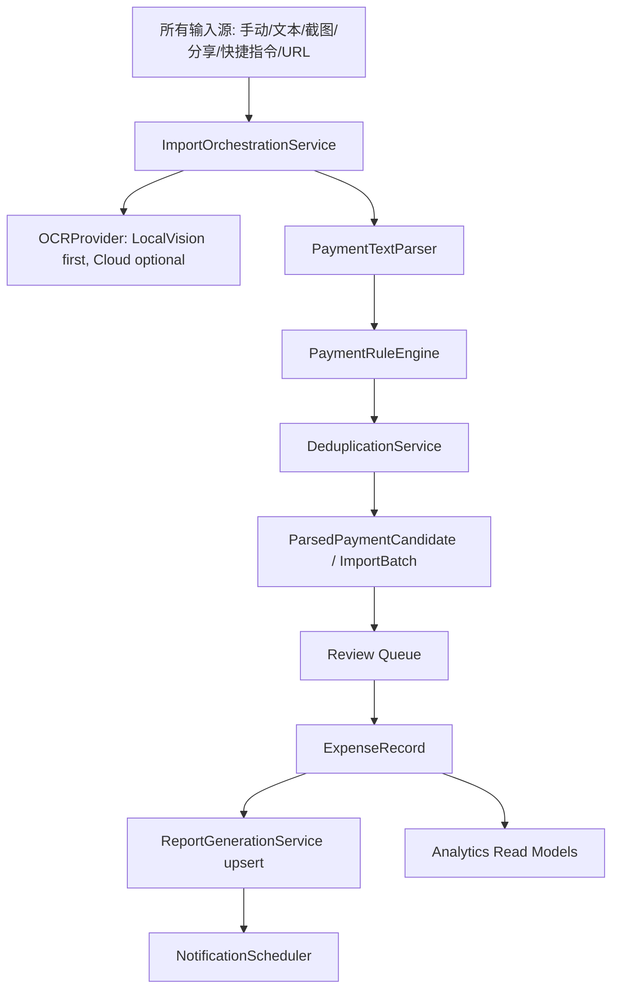

# 消费管家整体评审、PRD、UI/UX 设计稿与版本规划

日期：2026-05-24  
范围：`AwemeBillingApp` iPhone App、Share Extension、快捷指令/App Intent、落地页  
评审角色：产品、UI/UX、全栈研发、QA  
验证证据：
- 已读当前 SwiftUI、SwiftData、导入、归档、通知、分享扩展代码。
- 已运行 `xcodebuild -project AwemeBillingApp/AwemeBillingApp.xcodeproj -scheme AwemeBillingApp -destination 'platform=iOS Simulator,name=iPhone 17' build`，结果 `BUILD SUCCEEDED`。
- 已安装并启动 iPhone 17 模拟器，首屏截图见 `docs/awemebilling-overview-simulator.png`。首次截图曾短暂白屏，稍后正常渲染，说明启动体验需要显式加载/恢复状态兜底。

## 1. 结论摘要

消费管家已经有一个可工作的本地优先记账原型：支持手动记账、文本/截图解析、候选复核、消费总览、明细聚合、归档报告、通知提醒、快捷指令和分享扩展。当前最大的问题不是功能数量，而是“自动归档你的每一笔消费”这个核心价值在产品路径、信息架构和数据管线里还没有真正合拢。

优先级最高的迭代方向：
1. 把所有导入入口统一到同一条 Import Pipeline，避免分享扩展、快捷指令、URL、App 内截图导入各自写账。
2. 重做首屏空状态和主 CTA，让新用户一打开就知道下一步是“导入截图 / 粘贴通知 / 手动记一笔”。
3. 把“归档报告”从隐藏能力提升为一级可感知能力，形成“导入 -> 复核 -> 入账 -> 报告”的闭环。
4. 补上 Parser、Dedup、Archive、Import Pipeline 的测试，否则后续 OCR/账单格式扩展会非常脆。
5. 修复已发现的产品/代码不一致：明细默认周期设置未生效、场景/归档页面不可达、云 OCR 与“本地优先”文案存在隐私预期冲突。

## 2. 产品 PRD

### 2.1 产品定位

消费管家是一款本地优先的 iPhone 个人消费管理工具，把用户主动提供的支付截图、账单文本、快捷指令输入，转成可复核、可追踪、可归档的个人消费档案。

一句话价值主张：
> 把散落在微信、支付宝、云闪付、银行通知里的消费，整理成你能复盘的账本和周期报告。

### 2.2 目标用户

核心用户：
- 经常用微信、支付宝、云闪付、银行卡消费，但不愿每天手动记账的人。
- 对隐私敏感，不希望把完整支付流水上传到公开表格或第三方记账平台的人。
- 希望月底知道钱花在哪里，但不想维护复杂复式账本的人。

高价值场景：
- 支付后截图或保存通知文本，希望快速入账。
- 月底/周末复盘分类、场景、渠道占比。
- 想保留日、周、月、季度、年度消费报告。
- 想用快捷指令从系统自动化把消费送进 App。

非目标场景：
- 不做跨 App 后台静默监听支付通知。
- 不做银行级财务会计系统。
- 不把“自动 OCR”包装成无需复核的绝对正确能力。

### 2.3 产品目标与指标

北极星指标：
- 每周被确认入账的消费笔数。

关键指标：
- 新用户首日完成首次入账率。
- 解析后候选确认率。
- 重复导入拦截率。
- 归档报告打开率。
- OCR 失败率和用户手动修正率。

质量指标：
- 核心导入路径无重复入账。
- 解析候选永远可复核、可忽略、可编辑。
- 周期报告边界准确，尤其是“昨日、上周、上月”。
- 无数据时首屏不空、不冷、不让用户迷路。

### 2.4 MVP 范围

必须有：
- 手动新增消费。
- 文本粘贴解析。
- 图片/截图 OCR 解析。
- 导入候选复核队列。
- 去重保护。
- 分类、场景、渠道聚合。
- 周期报告生成。
- 通知提醒和报告历史。
- 隐私/本地优先说明。

暂不做：
- 自动读取微信/支付宝/银行后台数据。
- 跨设备云同步。
- 多币种资产负债。
- 家庭多人账本。

### 2.5 核心用户旅程

旅程 A：首次使用
1. 用户打开 App。
2. 首屏看到“导入截图”“粘贴通知”“手动记一笔”三个明确入口。
3. App 解释本地优先、普通 App 不能后台读取支付 App。
4. 用户完成第一笔入账。
5. 首屏立即出现本期支出、最近消费、待复核/已归档状态。

旅程 B：截图导入
1. 用户选择截图或通过分享扩展/快捷指令传入截图。
2. App OCR 解析出候选消费。
3. 用户在复核队列里看到金额、商户、时间、分类、渠道、置信度。
4. 用户编辑异常字段，确认入账或忽略。
5. App 刷新总览、明细、报告和通知排程。

旅程 C：月底复盘
1. 用户打开“报告”。
2. 查看月度报告：总额、笔数、最高分类、主要场景、异常/趋势。
3. 可下钻到明细筛选。
4. 可调整归档提醒时间，但默认配置不打扰。

## 3. UI 设计稿

### 3.1 设计方向

设计关键词：
- 可信、安静、清晰、轻量、行动优先。

建议风格：
- 保留当前圆角 8px 卡片和 SF 系统字体，降低强阴影，提升信息层次。
- 财务类 App 不建议过度活泼、过度渐变或营销化。主色建议使用深蓝 + 青绿作为“可信 + 行动”的组合，风险/超支用红，提醒/待复核用琥珀。

建议色板：
- Background：`#F6F8FB`
- Card：`#FFFFFF`
- Ink：`#111827`
- Secondary Text：`#6B7280`
- Accent Blue：`#0A66C2`
- Success Teal：`#0F9F8F`
- Warning Amber：`#B7791F`
- Danger Red：`#DC2626`
- Separator：`rgba(17, 24, 39, 0.08)`

字体：
- iOS App：系统 `SF Pro` / `PingFang SC`。
- 金额数字：`.monospacedDigit()`。
- 金额层级：总金额可大，但在小屏上必须有 `minimumScaleFactor` 和明确的布局余量。

### 3.2 推荐信息架构

当前 Tab：
- 总览
- 明细
- 接入
- 我的

建议 Tab：
- 总览：本期状态、快捷入账、洞察、最近消费。
- 导入：截图/文本/分享/快捷指令入口 + 复核队列。
- 明细：查询、筛选、聚合、编辑。
- 报告：历史归档、周期报告、趋势。
- 我的：隐私、通知、规则、外观、开发边界。

原因：
- “接入”偏工程词，不如“导入”直观。
- “归档/报告”是核心价值，不应只藏在设置页或总览卡片里。
- 设置页应承载配置，不承载核心消费复盘。

### 3.3 首屏设计稿

```
┌────────────────────────────┐
│ 总览                         │
│ 本月支出        ¥0.00        │
│ 0 笔  0 待复核  0 已归档      │
│                              │
│ [导入截图] [粘贴通知] [记一笔] │
├────────────────────────────┤
│ 待处理                       │
│ 暂无待复核账单                │
├────────────────────────────┤
│ 消费洞察                     │
│ 记录第一笔消费后生成洞察       │
├────────────────────────────┤
│ 最近消费                     │
│ 暂无明细                     │
└────────────────────────────┘
```

当前首屏问题：
- 模拟器首屏虽然视觉干净，但空状态只告诉用户“暂无/记录更多”，没有直接提供下一步。
- “刷新消费总结”在无数据时占了过高权重，用户更需要的是导入/记账入口。
- 底部 Tab 的毛玻璃和内容在底部接近重叠，滚动内容需要更明确的 bottom inset。

修改建议：
- 在总览金额卡下方加入三枚主要操作按钮：导入截图、粘贴通知、记一笔。
- 空状态文案从“暂无”改为任务导向：“先导入一张支付截图，生成第一笔待复核账单”。
- “刷新消费总结”只在报告页出现，首屏展示最近一份报告摘要即可。

### 3.4 导入页设计稿

```
┌────────────────────────────┐
│ 导入                         │
│ [截图] [文本] [快捷指令]      │
├────────────────────────────┤
│ 截图导入                     │
│ ┌──────── 预览/选择区 ──────┐ │
│ └────────────────────────┘ │
│ [解析为待复核账单]            │
├────────────────────────────┤
│ 复核队列  3 笔 / ¥128.00     │
│ ┌ 商户A  ¥38.50  92%        │ │
│ │ 分类 / 渠道 / 时间可编辑    │ │
│ │ [忽略] [确认入账]          │ │
│ └────────────────────────┘ │
│ [全部确认]                   │
└────────────────────────────┘
```

交互建议：
- 解析成功后自动滚动到复核队列。
- 候选项显示置信度标签：高置信可弱化、低置信高亮提示复核。
- “全部确认”在存在低置信候选时改成二次确认。
- 图片解析失败时提供“改用文本粘贴”的路径。

### 3.5 明细页设计稿

```
┌────────────────────────────┐
│ 明细                    +   │
│ [搜索商户/备注]              │
│ [本月] [本周] [本季] [全部]  │
│ [明细] [聚合]                │
├────────────────────────────┤
│ 今天                         │
│ 商户A     餐饮/支付宝  ¥38.50 │
│ 左滑归档  右滑删除             │
└────────────────────────────┘
```

修改建议：
- 增加搜索入口。
- 增加“今天”周期，因为设置页已经暴露“明细默认周期：今天”，但明细页目前没有 day filter。
- 删除操作增加撤销 snackbar，避免误删。
- 聚合模式下可点击聚合行回到明细筛选。

### 3.6 报告页设计稿

```
┌────────────────────────────┐
│ 报告                         │
│ 本月报告  暂未生成 / 已生成    │
│ [刷新报告] [设置提醒]          │
├────────────────────────────┤
│ 历史报告                     │
│ 每日  2026/05/23  ¥42.00     │
│ 每周  2026/05/18-05/24       │
├────────────────────────────┤
│ 兜底推送设置                  │
│ > 每日/每周/每月...           │
└────────────────────────────┘
```

修改建议：
- 报告列表做成一级 Tab，设置折叠到底部。
- 报告详情页展示 body、分类排行、场景排行、关联明细。
- 报告生成逻辑从“删除重建”调整为“按周期 upsert + 保留历史快照”。

## 4. UX 评审与修改意见

### 4.1 高优先级 UX 问题

1. 新用户首屏缺少强行动入口  
   证据：`OverviewView` 主要展示 summary、insight、report、budget、category、recent，但无直接导入/记账 CTA。  
   建议：首屏固定展示导入/粘贴/记一笔入口，空状态引导实际任务。

2. 核心功能入口命名偏工程化  
   证据：Tab 名为“接入”，页面标题也是“接入”。  
   建议：改成“导入”或“入账”，更贴近用户语义。

3. 归档/报告价值被弱化  
   证据：`ArchiveScheduleView` 存在，但当前代码未发现任何 `NavigationLink` 或 Tab 入口引用它。  
   建议：报告独立成 Tab；设置只保留提醒配置。

4. 首次截图短暂白屏，缺少启动/加载状态  
   证据：模拟器 launch 后第一张截图为白屏，第二张才出现总览。  
   建议：添加轻量启动态或数据恢复态，避免用户以为 App 卡死。

5. 隐私预期不一致  
   证据：落地页说“截图识别失败时才使用系统 OCR 兜底”，但 `ReceiptImageParser` 当前优先腾讯 OCR、OCR.space，再用本地 Vision。  
   建议：默认本地 Vision 优先；云 OCR 必须在设置中显式启用，并说明会上传截图。

### 4.2 中低优先级 UX 问题

1. 明细默认周期设置未生效  
   证据：`ProfileSettingsView` 写入 `detailDefaultPeriod`，但 `DetailListView` 固定 `selectedPeriod = .all`，且没有 day case。  
   建议：读取 AppStorage 并补齐 day filter。

2. 场景分析页面不可达  
   证据：`SceneAnalysisView` 存在，但未被 Tab 或 NavigationLink 引用。  
   建议：合并进总览洞察，或作为明细聚合/报告详情入口。

3. 删除缺少撤销  
   证据：明细页 trailing swipe 直接 `modelContext.delete(record)`。  
   建议：删除先进入 pending undo，几秒后再提交。

4. 复核队列缺少批量风险控制  
   证据：`ImportReviewView` 允许全部确认。  
   建议：当存在低置信候选、缺失时间、金额异常时，全部确认需提示。

## 5. 系统设计与架构评审

### 5.1 当前架构图



问题点：图中 E/F 直接写 `ExpenseRecord`，绕过候选复核；URL 创建候选但不带清晰导航；报告/通知刷新逻辑分散在多个入口。

### 5.2 建议目标架构



架构原则：
- 所有入口先生成候选，除非用户明确选择“自动确认高置信候选”。
- 去重、规则学习、报告刷新、通知刷新集中在服务层。
- View 只负责展示状态和触发 Use Case，不直接拼业务流程。
- 报告作为可追溯快照，不在启动时无条件删除重建。

## 6. 代码实现问题与修改意见

### P1：分享扩展绕过复核与去重主流程

证据：
- `AwemeBillingShareExtension/ShareViewController.swift:54-68` 解析后直接创建并保存 `ExpenseRecord`。
- 该路径没有使用 `ImportPipeline.createBatch`，没有候选复核，没有复用 `ExpenseRecordMaintenance.uniquePayments`，也没有刷新报告/通知。

影响：
- 同一截图重复分享会重复入账。
- OCR 错误会直接污染账本。
- App 内“导入复核”与分享入口行为不一致。

建议：
- Share Extension 只创建 `ImportBatch` + `ParsedPaymentCandidate`，完成后引导用户回主 App 复核。
- 如果要支持“快速自动归档”，也必须先走统一 Dedup + Report Refresh，并将低置信候选留待复核。

### P1：云 OCR 与“本地优先”隐私承诺冲突

证据：
- `ReceiptImageParser.swift:14-35` 当前顺序是 Tencent OCR -> OCR.space -> Vision 本地 OCR。
- `landing/index.html:102-104` 暗示本地归档为核心，且“截图识别失败时才使用系统 OCR 兜底”的表述与实现方向不一致。

影响：
- 一旦配置云 OCR key，截图会优先发往第三方，用户没有在 App 内明确授权。

建议：
- 默认 `Vision` 本地 OCR 优先。
- 云 OCR 放到“我的 -> OCR 设置”，显式开关、供应商说明、隐私提示。
- 在导入页显示当前 OCR 模式。

### P1：报告重建是破坏式的，长期会丢失归档快照语义

证据：
- `ArchiveReportService.swift:42` 先删除所有 existing reports。
- `ArchiveReportService.swift:62` 最多只重建 40 份。
- `ContentView.swift:40-46` 在已有报告时启动即 rebuild。

影响：
- 历史报告不是真正的历史快照，而是当前明细反推结果。
- 用户编辑旧账后，历史报告会被改写；超过 40 份的报告会丢失。

建议：
- 报告表增加唯一键 `period + periodStart + periodEnd`。
- 生成时 upsert，当用户主动“重算”时保留 revision 或 generatedAt。
- 把“历史归档”与“当前实时分析”分开。

### P1：设置项“明细默认周期”未生效

证据：
- `ProfileSettingsView.swift:9`、`ProfileSettingsView.swift:32-36` 定义了 `detailDefaultPeriod`。
- `DetailListView.swift:10-12` 仍固定 `selectedPeriod = .all`，且 `ExpensePeriodFilter` 没有 `day`。

影响：
- 用户设置“今天/本周/本月”后回到明细页不会生效。

建议：
- `DetailListView` 使用 `@AppStorage("detailDefaultPeriod")` 初始化和监听。
- `ExpensePeriodFilter` 增加 `.day = "今天"`。

### P2：多个入口重复实现“保存后刷新报告/通知”

证据：
- `PaymentMonitorView.swift:302-320`
- `RecordExpenseIntent.swift:75-93`
- `RecordExpenseIntent.swift:177-195`
- `ScreenshotImportDeepLinkHandler.swift:34-55` 甚至定义了刷新函数但当前 handle 中未调用。

影响：
- 后续修复容易漏入口。
- 归档、通知、报告行为不稳定。

建议：
- 抽出 `ExpenseWriteService` 或 `PostExpenseMutationService`。
- 所有新增/编辑/接受候选后统一调用 `refreshReportsAndNotifications()`。

### P2：手动新增/编辑保存没有显式刷新报告与通知

证据：
- `ExpenseEditorView.swift:107-131` 插入或修改记录后直接 dismiss，没有显式 `modelContext.save()` 和报告/通知刷新。

影响：
- UI 上可能因为 SwiftData context 观察而更新，但报告/通知不会立即同步。

建议：
- 保存后显式 `try modelContext.save()`。
- 调用统一刷新服务。
- 编辑旧消费时更新对应报告。

### P2：核心页面不可达或入口弱

证据：
- `ArchiveScheduleView`、`SceneAnalysisView` 仅有定义，搜索未发现当前 App 内引用。

影响：
- 已实现功能无法形成用户路径。

建议：
- 报告页成为 Tab。
- 场景分析并入总览/明细聚合/报告详情。

### P2：缺少自动化测试

证据：
- 仓库内未发现 `XCTest`、Tests target 或测试文件。

影响：
- 账单解析、去重、周期边界、归档报告这类高风险逻辑只能靠手测。

建议：
- 新增单元测试 target。
- 优先覆盖：`PaymentTextParser`、`ExpenseRecordMaintenance`、`BillingAnalytics.completedPeriodInterval`、`ArchiveReportService`、`ImportPipeline`。

### P3：SwiftData 容器失败时直接崩溃

证据：
- `DataController.swift:25-29` 容器创建失败时 `fatalError`。

影响：
- App Group 配置、迁移、磁盘异常会直接白屏/崩溃。

建议：
- 提供只读错误页或内存 fallback。
- 对模型迁移建立版本策略。

## 7. QA 策略

### 7.1 必测功能矩阵

导入：
- 支付宝单条通知文本。
- 微信账单列表。
- 云闪付/银行卡文本。
- 同一截图重复导入。
- OCR 无金额、低置信、无时间、商户为空。

复核：
- 单笔确认。
- 全部确认。
- 忽略。
- 编辑金额/时间/分类/渠道。
- 候选重复后不入账。

明细：
- 新增、编辑、删除、归档/取消归档。
- 今天/本周/本月/本季/本年/全部筛选。
- 聚合维度切换。

报告：
- 昨日报告边界。
- 上周、上月、上季度、上一年边界。
- 编辑旧明细后报告刷新策略符合预期。
- 禁用某周期提醒时不误删历史报告。

权限：
- 相册权限拒绝、受限、允许。
- 通知权限拒绝、允许。
- 云 OCR 关闭/开启。

### 7.2 自动化测试优先级

第一批：
- Parser snapshot tests：用真实支付文本 fixtures 验证金额、商户、时间、渠道。
- Dedup tests：同金额同商户同分钟拦截；不同分钟不误拦截；编辑自身不误判。
- Period tests：固定 now 验证昨日、上周、上月、上季度边界。
- Report tests：有记录生成、无记录不生成、upsert 不重复。

第二批：
- ImportPipeline tests：createBatch、accept、ignore、duplicate status、batch status。
- UI tests：首次打开、导入页空状态、复核队列、明细默认周期。

## 8. 版本迭代规划

### V0.2：闭环可靠版

周期：1-2 周  
目标：把“导入 -> 复核 -> 入账 -> 报告”的主闭环做顺。

需求：
- 总览首屏增加导入/粘贴/记一笔 CTA。
- “接入”改为“导入”。
- 新增“报告”Tab，归档历史移入一级入口。
- 修复明细默认周期设置。
- Share Extension、App Intent、URL、App 内导入统一到 Import Pipeline。
- 默认本地 OCR 优先，云 OCR 需要显式启用。
- 新增核心单元测试 target。

验收：
- 所有入口重复导入同一消费不会重复入账。
- OCR 候选默认进入复核队列。
- 新用户无数据首屏能在 5 秒内理解下一步。
- `xcodebuild` 和第一批单元测试通过。

### V0.3：报告与规则增强版

周期：2-3 周  
目标：让报告成为可信任的历史资产，让分类越用越准。

需求：
- ArchiveReport 改为 upsert/保留历史快照。
- 报告详情页：总额、笔数、Top 分类、Top 场景、关联明细。
- 规则管理页：查看、禁用、删除自动学习规则。
- 导入队列支持按 batch 展开。
- OCR 失败 fallback：转文本粘贴、手动补录。

验收：
- 编辑旧账后报告刷新策略可解释、可控。
- 用户可管理错误学习的商户规则。
- 低置信候选不会被一键静默确认。

### V0.4：洞察与预算版

周期：3-4 周  
目标：从“记录工具”升级到“消费复盘工具”。

需求：
- 预算设置页，而不是只提供建议预算。
- 消费趋势图和分类结构图。
- 场景分析合并进报告/明细聚合。
- 搜索商户/备注。
- 删除撤销。
- 数据导出 CSV。

验收：
- 用户能完成“本月为什么超支”的复盘路径。
- 所有图表和聚合都有空状态、加载态、可访问标签。

### V1.0：Beta 发布版

周期：4-6 周  
目标：具备稳定外测质量。

需求：
- 完整 onboarding。
- 隐私说明、OCR provider 说明、权限说明。
- App Store 截图和落地页统一视觉。
- 模型迁移策略。
- 崩溃/错误日志本地可诊断。
- 完整回归测试清单。

验收：
- 50+ 条真实支付文本/截图样本回归通过。
- 主流程无 P0/P1 问题。
- 隐私文案与实际数据流一致。

## 9. 最小行动清单

建议下一轮直接改这 8 件事：
1. 改 Tab：`接入` -> `导入`，新增 `报告` Tab。
2. 总览加三枚 CTA：导入截图、粘贴通知、记一笔。
3. 修复 `detailDefaultPeriod` 未生效，并补 `今天` 筛选。
4. 默认本地 Vision OCR 优先，云 OCR 加设置开关。
5. 抽 `ImportOrchestrationService`，统一 App/Share/Intent/URL 导入。
6. Share Extension 不直接写 `ExpenseRecord`。
7. 报告生成改 upsert，不再启动时全删重建。
8. 新增 XCTest target，先测 parser/dedup/period/report。

