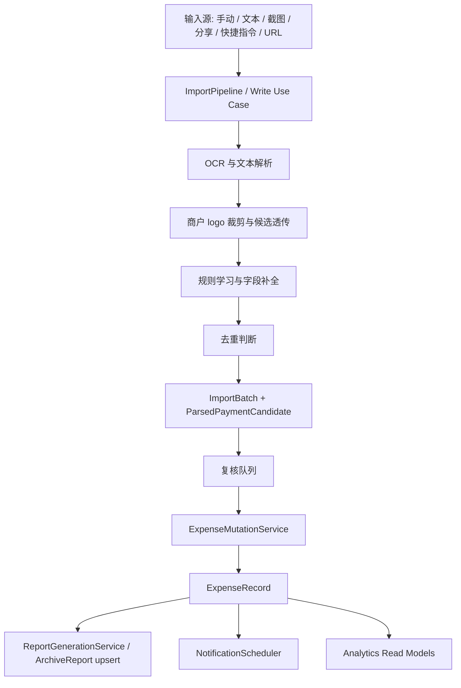

# 消费管家技术架构方案和回归测试方案

日期：2026-06-09
状态：当前实现同步版
范围：iPhone App、Share Extension、快捷指令/App Intent、导入管线、报告生成、通知、核心测试与回归流程  
关联产品设计文档：`docs/awemebilling-product-design.md`  
关联版本迭代文档：`docs/awemebilling-version-roadmap.md`

## 1. 架构结论

消费管家已经具备本地优先账本、截图/文本导入、候选复核、报告、通知、分享扩展和快捷指令能力。后续架构重点不是继续堆入口，而是把“导入 -> 复核 -> 入账 -> 报告/提醒刷新”收敛成一条稳定链路。

核心方向：

- 自动化入口只生成候选，用户复核后入账。
- 写入账本后的副作用统一由 mutation service 承接。
- 报告从破坏式重建转向按周期 upsert，并保留可追溯信息。
- OCR 作为内部质量策略，对用户只暴露结果、隐私边界和失败后的下一步。
- 回归测试围绕账本可信度，而不是只验证页面能打开。

## 2. 当前关键模块

### 2.1 数据模型

- `ExpenseRecord`：已确认入账的消费记录，是总览、明细、报告和通知的核心数据源。
- `ImportBatch`：一次导入任务，承接截图、文本、分享扩展、快捷指令等来源。
- `ParsedPaymentCandidate`：待复核候选记录，进入账本前必须可编辑、可忽略、可确认。
- `ParsedPayment` / `ParsedPaymentCandidate` / `ExpenseRecord`：截图导入链路需要透传并保存可选的 `merchantLogoPNGData`。该字段用于 UI 展示，不参与金额、时间、去重和统计计算。
- `PaymentRule`：商户、分类、支付方式等规则学习结果。
- `ArchiveReport`：周期报告记录，当前仍需从重建逻辑逐步升级为可信历史资产。
- `BudgetPlan`：预算与周期状态相关数据。

### 2.2 服务层

- `PaymentTextParser`：从通知文本或 OCR 文本中解析金额、商户、时间、支付方式。
- `ReceiptImageParser`：执行截图识别，并把识别文本交给 parser；统一维护 GLM、腾讯 OCR、OCR.space、本机 Vision 的识别入口。
- `ReceiptImageSegmenter`：在 OCR 前对微信/支付宝账单截图做灰线分段，并通过左侧视觉像素聚类裁剪商户 logo。分段失败时仍可从全图左侧直接提取 logo 序列。
- `ImportPipeline`：创建导入批次、生成候选、接受候选、忽略候选、更新批次状态。
- `PaymentRuleEngine`：从用户修正和历史记录中学习规则。
- `ExpenseMutationService`：承接写入后的报告与通知刷新。
- `ArchiveReportService`：生成周期报告，后续需要升级为 upsert。
- `ArchiveNotificationService`：管理归档/报告提醒。

## 3. 目标架构



### 3.1 输入与导入

- 手动记账可以直接写入 `ExpenseRecord`，但保存后必须走统一 mutation service。
- 文本、截图、分享扩展、快捷指令和 URL 深链都必须先进入 `ImportBatch` 与候选队列。
- 低置信、缺金额、缺商户、疑似重复的候选不能静默入账。
- `awemebilling://review-import` 必须稳定定位到导入页的当前批次或全部待复核队列。

### 3.2 写入与副作用

- 接受候选、手动新增、编辑、删除记录后统一触发保存、报告刷新和通知刷新。
- View 层只触发 use case，不直接拼接 `save + rebuildReports + scheduleNotifications`。
- 删除和批量操作必须有撤销或确认，避免账本不可恢复变化。

### 3.3 报告生成

- 0.3 前必须把报告从“全量删除重建”升级为“按周期唯一键 upsert”。
- 周期唯一键建议包含 `periodType + periodStart + periodEnd`。
- 报告需要保存生成时间、生成版本、来源记录摘要、状态和失败原因。
- 报告详情要能跳回明细筛选，让用户理解结论来自哪些记录。

### 3.4 OCR 与隐私

- OCR provider 不作为普通用户设置项暴露。
- 用户看到的是“自动识别成功 / 本机兜底 / 识别失败 / 需要重点核对”的结果状态。
- 隐私说明必须解释什么数据可能上传、为什么上传、如何关闭相关能力以及关闭后的替代路径。
- OCR 统一入口顺序为 GLM -> 腾讯 OCR -> OCR.space -> 本机 Vision，渠道解析可以分开优化，但 provider 调度不应多处重复实现。
- 商户 logo 裁剪优先在本机完成：先按浅灰/深色分隔线切行，再按左侧彩色像素聚类裁剪；无法分段时用全图左侧 logo 序列兜底。
- OCR 回归样本优先使用脱敏文本 fixture；需要截图 fixture 时必须确认可提交范围，避免把敏感截图误纳入公开仓库。

## 4. 技术风险与改进点

1. 导入入口一致性
   - 风险：分享扩展、快捷指令、App 内导入、URL 深链行为不一致。
   - 改进：所有自动化入口统一进入 `ImportPipeline`，只产出候选。

2. 报告可信度
   - 风险：报告重建会改写历史语义，长期损害用户信任。
   - 改进：0.3 实现报告 upsert、状态、来源摘要和详情页。

3. 副作用分散
   - 风险：某些入口保存后刷新报告，某些入口遗漏刷新。
   - 改进：继续收敛到 `ExpenseMutationService`。

4. OCR 与截图视觉样本不足
   - 风险：少量单测无法覆盖真实账单截图复杂度，尤其是灰线分段、错行、商户 logo 裁剪和渠道差异。
   - 改进：继续建立微信、支付宝、银行卡通知的脱敏文本 fixture；对已授权截图保留真实图片回归，覆盖解析字段和 logo 数据透传。

5. 版本信息遗漏
   - 风险：后续版本完成后忘记更新用户可见版本号和变化简介。
   - 改进：把 App 构建版本、“我的”页当前版本号和版本变化简介放入发布检查。

## 5. 回归测试策略

### 5.1 单元测试

第一批必须覆盖：

- `PaymentTextParser`
  - 金额、商户、时间、支付方式解析。
  - 微信、支付宝、银行卡通知样本。
  - 无金额、无时间、商户为空等失败样本。
- `ImportPipeline`
  - `createBatch` 生成待复核候选。
  - 接受候选只入账一次。
  - 忽略候选不创建记录。
  - 疑似重复候选正确标记。
- `ReceiptImageParser`
  - 高质量识别文本优先。
  - 失败后兜底文本可解析。
  - 无有效文本时给出可解释失败。
  - GLM 整图结构化返回时，仍能按可见账单行顺序把本机裁剪 logo 绑定到解析结果。
  - 腾讯 OCR、OCR.space、本机 Vision 的分段候选都能携带对应行的 logo 数据。
  - 微信/支付宝历史截图 fixture 能切出多枚商户 logo。
- 周期与报告
  - 昨日、上周、上月、上季度、上一年边界。
  - 报告 upsert 不重复、不丢历史。
  - 编辑旧记录后的报告刷新策略可解释。
- 去重
  - 同金额、同商户、同分钟拦截。
  - 不同时间或不同商户不误拦截。
  - 编辑自身不触发重复误判。

### 5.2 集成测试

重点路径：

- 分享截图进入 App 后展示待复核候选。
- 截图导入候选卡片显示商户原始 logo；确认入账后明细列表仍保留该 logo。
- 粘贴文本后顶部待复核数量、当前批次、全部待复核一致。
- 接受候选后总览、明细、报告摘要同步刷新。
- 手动新增、编辑、删除后触发同一套 mutation 流程。
- 报告详情可跳转到对应明细筛选。
- “我的”页显示当前版本号和本版本变化简介。

### 5.3 UI 回归

必须手测的界面：

- 总览：空状态、预算、异常提示、最近记录、记一笔。
- 导入：空状态、当前批次、全部待复核、低置信提示、重复提示。
- 明细：今天/本周/本月筛选、搜索、编辑、删除确认或撤销。
- 报告：周期切换、报告列表、报告详情、提醒设置折叠态。
- 我的：隐私说明、通知、数据管理、版本变化。

### 5.4 发布前检查清单

- `xcodebuild` 真机或模拟器 build 通过。
- 单元测试 target 可构建，并且核心测试通过。
- 至少 20 条脱敏支付文本 fixture 通过解析回归；已授权微信/支付宝截图 fixture 要覆盖解析字段和商户 logo 保留。
- 分享扩展、快捷指令、App 内导入不绕过复核队列。
- 报告刷新不产生重复报告，也不删除用户期望保留的历史报告。
- 用户可见版本号不带 `v` 前缀，并与 App 构建版本一致。
- “我的”页版本变化简介已更新，历史版本变化可回看。

## 6. 推荐验证命令

模拟器构建：

```sh
xcodebuild -project AwemeBillingApp/AwemeBillingApp.xcodeproj -scheme AwemeBillingApp -destination 'platform=iOS Simulator,name=iPhone 17' build
```

真机构建：

```sh
xcodebuild -project AwemeBillingApp/AwemeBillingApp.xcodeproj -scheme AwemeBillingApp -configuration Debug -destination 'generic/platform=iOS' -derivedDataPath DerivedData-device-install -allowProvisioningUpdates build
```

测试构建：

```sh
xcodebuild -project AwemeBillingApp/AwemeBillingApp.xcodeproj -scheme AwemeBillingApp -destination 'generic/platform=iOS Simulator' build-for-testing
```
